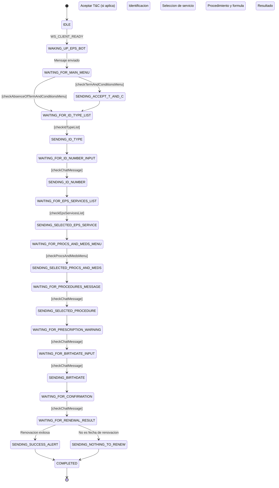

# Bot/Script Renuevamedicamentos-Inador para EPS

Necesitaba un pequeño bot/script que me ayudara a renovar los medicamentos en la EPS para mi mamá y mi papá. El proceso manual es repetitivo y me da mucha locha hacerlo (Las EPS son 💩). Aprovechando el envión, decidí aprender sobre **máquinas de estado** con XState, por eso tal vez el código puede pecar de sobreingeniería, pero la idea es aprender. Aunque es un poco tedioso acoplarse al modelo de máquinas de estado, me parece que el resultado es fácil de documentar y termina siendo bastante claro.

> Intenta jugar un poco con el [playground interactivo](#playground-interactivo) en la carpeta `docs/`.

## Tech Stack

| Tecnologia | Version | Uso |
| --- | --- | --- |
| [Bun](https://bun.sh) | 1.3+ | Runtime y gestor de paquetes |
| [TypeScript](https://www.typescriptlang.org) | 5 | Tipado estatico |
| [XState](https://xstate.js.org) | 5.28 | Maquina de estados para el flujo conversacional |
| [whatsapp-web.js](https://wwebjs.dev) | 1.34 | Cliente de WhatsApp (Puppeteer + Chrome) |
| [Biome](https://biomejs.dev) | 2.4 | Linter y formatter |

## Prerequisitos

- **Bun** instalado ([instrucciones](https://bun.sh/docs/installation))
- **WhatsApp** con una sesion activa (para escanear el QR la primera vez)
- El **Chat ID** del bot de la EPS (formato: `57XXXXXXXXXX@c.us`)
- Tu **numero de cedula**, **tipo de documento** y **fecha de nacimiento**
- Un **Chat ID de destino** para recibir alertas del resultado de la renovacion

## Setup

1. Instala las dependencias:

    ```bash
    bun install
    ```

2. Crea el archivo de variables de entorno a partir de la plantilla:

    ```bash
    cp .env.example .env
    ```

3. Edita `.env` con tus datos reales:

    ```env
    EPS_CHAT_ID=57XXXXXXXXXX@c.us                      # Chat ID del bot de la EPS en WhatsApp
    ID_NUMBER=XXXXXXXXXX                                # Tu numero de identificacion
    ID_TYPE=Cédula de ciudadanía                        # Tipo de documento (como aparece en la lista de la EPS)
    BIRTHDATE=DD/MM/AAAA                                # Tu fecha de nacimiento
    USER_TO_ALERT_CHAT_ID=57XXXXXXXXXX@c.us             # Chat ID donde enviar alertas de resultado
    SUCCESS_ALERT_MESSAGE=Tu mensaje de alerta aquí     # Mensaje cuando la renovacion es exitosa
    NOTHING_TO_RENEW_ALERT_MESSAGE=Tu mensaje aquí      # Mensaje cuando no hay medicamentos por renovar
    TECH_ALERT_CHAT_ID=57XXXXXXXXXX@c.us                # Chat ID para alertas de errores tecnicos
    ```

## Scripts

| Comando | Descripcion |
| --- | --- |
| `bun run start` | Ejecuta el bot (entry point con XState) |
| `bun run start:watch` | Ejecuta en modo watch (reinicia al guardar cambios) |
| `bun run format:changed` | Formatea archivos modificados (vs HEAD) con Biome |
| `bun run format:staged` | Formatea archivos en staging con Biome |

## Estructura del proyecto

```txt
eps-bot-prueba-1/
├── src/
│   ├── index.ts               # Entry point principal (cliente WhatsApp + maquina de estados)
│   ├── renewMedsMachine.ts    # Definicion de la maquina de estados (XState)
│   ├── constants.ts           # Constantes de estados, eventos y opciones de procedimientos
│   ├── guards.ts              # Guards (validaciones) para las transiciones de estado
│   ├── types.ts               # Interfaces TypeScript (mensajes, contexto, input)
│   └── config.ts              # Validacion de env vars + utilidades de masking
├── docs/
│   ├── renewMedsMachine-playground.html   # Playground interactivo
│   └── sample-data/                       # Datos de ejemplo de mensajes de la EPS
│       ├── dynamic-reply-buttons-data.json
│       ├── example-of-sections-list-message.json
│       └── chats-eps/                     # Capturas de pantalla de referencia
├── .env.example               # Plantilla de variables de entorno
├── biome.json                 # Configuracion de Biome (linter/formatter)
├── tsconfig.json              # Configuracion de TypeScript
└── package.json
```

## Como funciona

El bot usa una **maquina de estados** (XState v5) para gestionar el flujo conversacional con el bot de la EPS. Cada estado representa un paso en el proceso de renovacion de medicamentos.

### Diagrama de estados



> **Nota:** por legibilidad, se omiten las transiciones de error a `COMPLETED` que existen en cada estado. Si un mensaje no coincide con el patron esperado o un envio falla, la maquina va directamente a `COMPLETED`.

### Descripcion de cada estado

Los estados siguen un patron de pares: un estado `WAITING_FOR_*` espera un mensaje del bot de la EPS, y el estado `SENDING_*` que le sigue envia la respuesta correspondiente.

**Inicio**

| Estado | Que hace |
| --- | --- |
| `IDLE` | Espera a que el cliente de WhatsApp este listo (`WS_CLIENT_READY`) |
| `WAKING_UP_EPS_BOT` | Envia el mensaje inicial: _"Hola, necesito pedir mis medicamentos"_ |

**Aceptacion de terminos y condiciones**

| Estado | Que hace |
| --- | --- |
| `WAITING_FOR_MAIN_MENU` | Espera la respuesta del bot. Bifurca: si hay menu de T&C lo acepta, si no hay menu salta a tipo de documento |
| `SENDING_ACCEPT_TERMS_AND_CONDITIONS` | Envia "Acepto" como respuesta al menu de T&C |

**Identificacion del usuario**

| Estado | Que hace |
| --- | --- |
| `WAITING_FOR_ID_TYPE_LIST` | Espera la lista de tipos de documento (cedula, pasaporte, etc.) |
| `SENDING_ID_TYPE` | Envia el tipo de documento configurado en `ID_TYPE` |
| `WAITING_FOR_ID_NUMBER_INPUT_MESSAGE` | Espera el prompt para ingresar el numero de documento |
| `SENDING_ID_NUMBER` | Envia el numero de documento configurado en `ID_NUMBER` |

**Seleccion de servicio**

| Estado | Que hace |
| --- | --- |
| `WAITING_FOR_EPS_SERVICES_LIST` | Espera la lista de servicios de la EPS |
| `SENDING_SELECTED_EPS_SERVICE` | Envia "Tramites y Medicamentos" |
| `WAITING_FOR_PROCS_AND_MEDS_MENU` | Espera el submenu de tramites y medicamentos |
| `SENDING_SELECTED_PROCS_AND_MEDS_OPTION` | Envia "Tramites" |

**Procedimiento y formula**

| Estado | Que hace |
| --- | --- |
| `WAITING_FOR_PROCEDURES_MESSAGE` | Espera el menu de procedimientos disponibles |
| `SENDING_SELECTED_PROCEDURE_OPTION` | Envia "3" (renovacion mensual de formula de medicamentos) |
| `WAITING_FOR_ACTIVE_PRESCRIPTION_WARNING` | Espera el aviso sobre formulas vigentes |
| `WAITING_FOR_BIRTHDATE_INPUT_MESSAGE` | Espera el prompt para ingresar la fecha de nacimiento |
| `SENDING_BIRTHDATE` | Envia la fecha de nacimiento configurada en `BIRTHDATE` |

**Resultado**

| Estado | Que hace |
| --- | --- |
| `WAITING_FOR_CONFIRMATION_OF_PRESCRIPTION_RENEWAL` | Espera la confirmacion de que la solicitud fue recibida |
| `WAITING_FOR_PRESCRIPTION_RENEWAL_SUCCESS` | Bifurca segun resultado: renovacion exitosa o "no es fecha de renovacion" |
| `SENDING_SUCCESS_MESSAGE_ALERT` | Envia alerta de exito al chat configurado en `USER_TO_ALERT_CHAT_ID` |
| `SENDING_NOTHING_TO_RENEW_MESSAGE` | Envia alerta de "nada que renovar" al chat configurado |

**Final**

| Estado | Que hace |
| --- | --- |
| `COMPLETED` | Estado final — la maquina se detiene y el cliente de WhatsApp se cierra |

### Guards (condiciones)

Cada guard valida que el mensaje recibido del bot coincida con el paso esperado del flujo. Si la validacion falla, la maquina va a `COMPLETED`.

| Guard | Que valida |
| --- | --- |
| `checkTermAndConditionsMenu` | Que el mensaje contenga el texto de bienvenida y que el primer boton sea "Acepto" |
| `checkAbsenceOfTermAndConditionsMenu` | Camino alternativo: el bot saluda sin mostrar botones de T&C (ya fueron aceptados previamente) |
| `checkIdTypeList` | Que la lista de tipos de documento contenga el tipo configurado en `ID_TYPE` |
| `checkChatMessage` | Guard generico: valida que el texto del mensaje contenga una subcadena esperada (reutilizado en varios estados) |
| `checkEpsServicesList` | Que la lista de servicios contenga "Tramites y Medicamentos" |
| `checkProcsAndMedsMenu` | Que el menu de respuesta contenga el boton "Tramites" |

### Inyeccion de dependencias

La maquina declara un servicio `sendMessageService` con una implementacion por defecto que lanza error. En `index.ts` se inyecta la implementacion real usando `machine.provide()`:

```typescript
const renewMedsMachineWithDeps = renewMedsMachine.provide({
  actors: {
    sendMessageService: fromPromise(async ({ input }) => {
      return await client.sendMessage(ENV.EPS_CHAT_ID, input.message);
    }),
  },
});
```

Esto permite testear la maquina sin un cliente de WhatsApp real.

## Playground interactivo

Abre `docs/renewMedsMachine-playground.html` en tu navegador para experimentar con la maquina de estados sin necesidad de WhatsApp:

- Dispara eventos (`WS_CLIENT_READY`, `MESSAGE_RECEIVED`) manualmente
- Observa las transiciones de estado en tiempo real
- Prueba los guards con datos de ejemplo
- Visualiza el contexto de la maquina

## Seguridad

- Las credenciales (`EPS_CHAT_ID`, `ID_NUMBER`, `BIRTHDATE`, etc.) viven exclusivamente en `.env`, **nunca en el codigo fuente**
- `.env` esta incluido en `.gitignore` — no se sube al repositorio
- Los logs usan funciones de masking para no exponer datos sensibles:
  - `maskPhone()`: `573175180237@c.us` &rarr; `5731***0237@c.us`
  - `maskIdNumber()`: `1234567890` &rarr; `123***7890`
- `.env.example` sirve como plantilla segura con valores de ejemplo

---
