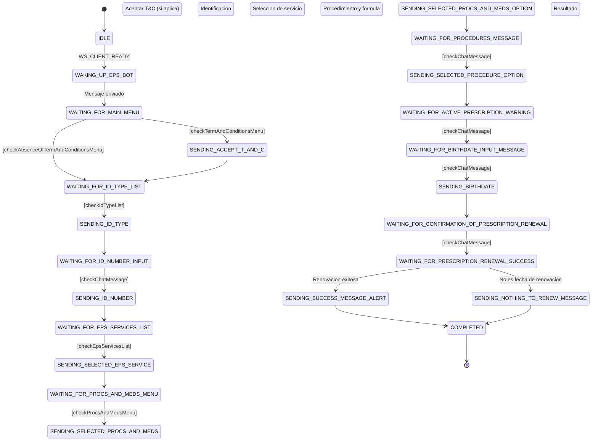

# Bot/Script Renuevamedicamentos-Inador para EPS

Necesitaba un pequeño bot/script que me ayudara a renovar los medicamentos en la EPS para mi mamá y mi papá. El proceso manual es repetitivo y me da mucha locha hacerlo (Las EPS son 💩). Aprovechando el envión, decidí aprender sobre **máquinas de estado** con XState, por eso tal vez el código puede pecar de sobreingeniería, pero la idea es aprender. Aunque es un poco tedioso acoplarse al modelo de máquinas de estado, me parece que el resultado es fácil de documentar y termina siendo bastante claro.

`renuevamedicamentos-inador` automatiza el flujo de renovación mensual de medicamentos en la EPS SURA usando WhatsApp. La experiencia principal del proyecto es una CLI: primero configuras tus datos con `init` y después ejecutas `renew` cada vez que necesites lanzar el proceso.

> Intenta jugar un poco con el [playground interactivo](#playground-interactivo) en la carpeta `docs/`.

## Flujo recomendado

1. Ejecuta `renuevamedicamentos-inador init` para guardar tu configuración.
2. Ejecuta `renuevamedicamentos-inador renew` para iniciar la renovación.

## Requisitos

- La CLI `renuevamedicamentos-inador` ya instalada y disponible en tu `PATH`
- **WhatsApp** con una sesion activa (para escanear el QR la primera vez)
- El **Chat ID** del bot de la EPS (formato: `57XXXXXXXXXX@c.us`)
- Los datos del paciente: **numero de cedula**, **tipo de documento** y **fecha de nacimiento**
- Un **Chat ID de destino** para recibir alertas del resultado de la renovacion

## Uso

> Los ejemplos de esta seccion asumen que la CLI ya esta instalada. Si la ejecutas desde este repositorio durante desarrollo, reemplaza `renuevamedicamentos-inador` por `bun run start`.

### Comando `init`

Crea o actualiza el archivo de configuracion global de forma interactiva:

```bash
renuevamedicamentos-inador init
```

Durante el flujo:

- Muestra un banner de bienvenida con la ruta exacta del `config.json`
- Si ya existe una configuracion, enseña una vista previa enmascarada antes de preguntar si deseas sobreescribirla
- Pide los datos del paciente, los Chat IDs y los mensajes de alerta
- Guarda la configuracion global y te indica que el siguiente paso es usar `renew`

Por defecto, el archivo se guarda en `~/.config/renuevamedicamentos-inador/config.json` siguiendo la convención XDG. Si `XDG_CONFIG_HOME` está definido, se usa esa ruta.

### Comando `renew`

Si ya configuraste tus datos con `init`, el camino mas corto es:

```bash
renuevamedicamentos-inador renew
```

Si quieres sobreescribir valores para una ejecucion puntual, puedes pasarlos por CLI:

```bash
renuevamedicamentos-inador renew \
  --idType "Cédula de ciudadanía" \
  --idNumber "1234567890" \
  --birthdate "01/01/1990"
```

### Prioridad de configuracion

Cuando ejecutas `renew`, la configuracion final se resuelve con esta prioridad:

1. **Argumentos CLI**
   Valores pasados directamente al ejecutar `renuevamedicamentos-inador renew ...`
2. **Variables de entorno**
   Valores presentes en `.env` o en `process.env`
3. **`config.json` global**
   Archivo guardado por `init` en la ruta XDG del usuario

Si un valor existe en multiples fuentes, gana la de mayor prioridad.

Orden real de lectura por tipo de valor:

- `idType`, `idNumber`, `birthdate`, `userToAlertChatId`, `successAlertMessage`, `nothingToRenewAlertMessage`, `techAlertChatId`
  CLI -> `.env` / `process.env` -> `config.json` global
- `epsChatId`
  `.env` / `process.env` -> `config.json` global

`epsChatId` es la unica excepcion importante: no se expone como argumento CLI.

### Opciones disponibles en `renew`

| Opcion | Descripcion | Fuentes posibles |
| --- | --- | --- |
| `--idType` | Tipo de documento del paciente | CLI / `.env` / config global |
| `--idNumber` | Numero de documento del paciente | CLI / `.env` / config global |
| `--birthdate` | Fecha de nacimiento en formato `DD/MM/AAAA` | CLI / `.env` / config global |
| `--userToAlertChatId` | Chat ID donde enviar alertas de resultado | CLI / `.env` / config global |
| `--successAlertMessage` | Mensaje cuando el proceso termina exitosamente | CLI / `.env` / config global |
| `--nothingToRenewAlertMessage` | Mensaje cuando no hay medicamentos por renovar | CLI / `.env` / config global |
| `--techAlertChatId` | Chat ID donde enviar alertas tecnicas | CLI / `.env` / config global |

> Para ver todas las opciones disponibles: `renuevamedicamentos-inador renew --help`

## Desarrollo local

Si estas trabajando desde este repositorio, usa Bun para instalar dependencias y ejecutar la CLI localmente.

### Setup del repo

1. Instala las dependencias:

    ```bash
    bun install
    ```

2. Ejecuta la CLI local:

    ```bash
    bun run start --help
    bun run start init
    bun run start renew --help
    ```

3. Si prefieres usar variables de entorno para desarrollo local, crea `.env` a partir de `.env.example` y completa tus datos reales.

## Tech Stack

| Tecnologia | Version | Uso |
| --- | --- | --- |
| [Bun](https://bun.sh) | 1.3+ | Runtime y gestor de paquetes |
| [TypeScript](https://www.typescriptlang.org) | 5 | Tipado estatico |
| [XState](https://xstate.js.org) | 5.28 | Maquina de estados para el flujo conversacional |
| [whatsapp-web.js](https://wwebjs.dev) | 1.34 | Cliente de WhatsApp (Puppeteer + Chrome) |
| [citty](https://github.com/unjs/citty) | 0.2 | Framework CLI para subcomandos y parsing de argumentos |
| [consola](https://github.com/unjs/consola) | 3.4 | Logger estructurado para la CLI |
| [Biome](https://biomejs.dev) | 2.4 | Linter y formatter |

## Scripts

| Comando | Descripcion |
| --- | --- |
| `bun run start` | Ejecuta la CLI (ver subcomandos con `--help`) |
| `bun run start:watch` | Ejecuta en modo watch (reinicia al guardar cambios) |
| `bun run format:changed` | Formatea archivos modificados (vs HEAD) con Biome |
| `bun run format:staged` | Formatea archivos en staging con Biome |

## Estructura del proyecto

```txt
renuevamedicamentos-inador/
├── src/
│   ├── cli/                           # Capa de entrada CLI (citty + consola)
│   │   ├── main.ts                    # Composicion principal de la CLI y registro de subcomandos
│   │   └── commands/
│   │       ├── init/
│   │       │   ├── command.ts         # Comando "init": coordina el flujo interactivo
│   │       │   ├── prompts.ts         # Helpers de prompts y cancelacion
│   │       │   └── presentation.ts    # Banner, hints y preview enmascarado
│   │       └── renew/
│   │           └── command.ts         # Comando "renew": resuelve config y arranca el bot
│   ├── config/                         # Configuracion: tipos, resolucion, persistencia y rutas XDG
│   │   ├── types.ts                   # Tipo ValidatedConfig compartido entre CLI y orquestacion
│   │   ├── resolve.ts                 # Resuelve config final: CLI args > .env > config.json global
│   │   ├── global-store.ts            # Lectura/escritura del config.json global
│   │   └── paths.ts                   # Ruta XDG del config.json de la aplicacion
│   ├── domain/                         # Logica de negocio pura (sin dependencias externas)
│   │   ├── renewMedsMachine.ts         # Definicion de la maquina de estados (XState)
│   │   ├── guards.ts                   # Guards (validaciones) para las transiciones de estado
│   │   ├── constants.ts                # Constantes de estados, eventos, tipos de documento
│   │   └── types.ts                    # Interfaces TypeScript del dominio (contexto, input)
│   ├── ports/                          # Contratos/interfaces (independientes de libreria)
│   │   ├── whatsappPort.ts             # Interfaz WhatsAppPort + tipos IncomingMessage y ListOption
│   │   └── mappers/
│   │       └── parseMessage.ts         # Convierte mensajes crudos de WS al formato del port
│   ├── adapters/                       # Implementaciones concretas de los ports
│   │   └── whatsappWebJs.ts            # Adapter de whatsapp-web.js que implementa WhatsAppPort
│   ├── services/                       # Servicios de aplicacion (conectan dominio con adapters)
│   │   └── actorServices.ts            # Factory de actores XState con inyeccion de WhatsAppPort
│   ├── utils/                          # Utilidades compartidas
│   │   └── masking.ts                 # Funciones de masking para datos sensibles en logs
│   ├── orchestrator.ts                 # Orquestacion: configura actor, conecta WhatsApp y maneja ciclo de vida
│   └── cli.ts                          # Entry point delgado: delega en src/cli/main.ts
├── docs/
│   ├── renewMedsMachine-playground.html   # Playground interactivo
│   └── sample-data/                       # Datos de ejemplo de mensajes de la EPS
│       ├── dynamic-reply-buttons-data.json
│       ├── example-of-sections-list-message.json
│       └── chats-eps/                     # Capturas de pantalla de referencia
├── .env.example               # Plantilla de variables de entorno
├── biome.json                 # Configuracion de Biome (linter/formatter)
├── tsconfig.json              # Configuracion de TypeScript
└── package.json
```

## Como funciona

El bot usa una **maquina de estados** (XState v5) para gestionar el flujo conversacional con el bot de la EPS. Cada estado representa un paso en el proceso de renovacion de medicamentos.

### Diagrama de estados



> **Nota:** por legibilidad, se omiten las transiciones de error a `COMPLETED` que existen en cada estado. Si un mensaje no coincide con el patron esperado o un envio falla, la maquina va directamente a `COMPLETED`.

### Descripcion de cada estado

Los estados siguen un patron de pares: un estado `WAITING_FOR_*` espera un mensaje del bot de la EPS, y el estado `SENDING_*` que le sigue envia la respuesta correspondiente.

**Inicio**

| Estado | Que hace |
| --- | --- |
| `IDLE` | Espera a que el cliente de WhatsApp este listo (`WS_CLIENT_READY`) |
| `WAKING_UP_EPS_BOT` | Envia el mensaje inicial: _"Hola, necesito pedir mis medicamentos"_ |

**Aceptacion de terminos y condiciones**

| Estado | Que hace |
| --- | --- |
| `WAITING_FOR_MAIN_MENU` | Espera la respuesta del bot. Bifurca: si hay menu de T&C lo acepta, si no hay menu salta a tipo de documento |
| `SENDING_ACCEPT_TERMS_AND_CONDITIONS` | Envia "Acepto" como respuesta al menu de T&C |

**Identificacion del usuario**

| Estado | Que hace |
| --- | --- |
| `WAITING_FOR_ID_TYPE_LIST` | Espera la lista de tipos de documento (cedula, pasaporte, etc.) |
| `SENDING_ID_TYPE` | Envia el tipo de documento resuelto desde la configuracion final |
| `WAITING_FOR_ID_NUMBER_INPUT_MESSAGE` | Espera el prompt para ingresar el numero de documento |
| `SENDING_ID_NUMBER` | Envia el numero de documento resuelto desde la configuracion final |

**Seleccion de servicio**

| Estado | Que hace |
| --- | --- |
| `WAITING_FOR_EPS_SERVICES_LIST` | Espera la lista de servicios de la EPS |
| `SENDING_SELECTED_EPS_SERVICE` | Envia "Tramites y Medicamentos" |
| `WAITING_FOR_PROCS_AND_MEDS_MENU` | Espera el submenu de tramites y medicamentos |
| `SENDING_SELECTED_PROCS_AND_MEDS_OPTION` | Envia "Tramites" |

**Procedimiento y formula**

| Estado | Que hace |
| --- | --- |
| `WAITING_FOR_PROCEDURES_MESSAGE` | Espera el menu de procedimientos disponibles |
| `SENDING_SELECTED_PROCEDURE_OPTION` | Envia "3" (renovacion mensual de formula de medicamentos) |
| `WAITING_FOR_ACTIVE_PRESCRIPTION_WARNING` | Espera el aviso sobre formulas vigentes |
| `WAITING_FOR_BIRTHDATE_INPUT_MESSAGE` | Espera el prompt para ingresar la fecha de nacimiento |
| `SENDING_BIRTHDATE` | Envia la fecha de nacimiento resuelta desde la configuracion final |

**Resultado**

| Estado | Que hace |
| --- | --- |
| `WAITING_FOR_CONFIRMATION_OF_PRESCRIPTION_RENEWAL` | Espera la confirmacion de que la solicitud fue recibida |
| `WAITING_FOR_PRESCRIPTION_RENEWAL_SUCCESS` | Bifurca segun resultado: renovacion exitosa o "no es fecha de renovacion" |
| `SENDING_SUCCESS_MESSAGE_ALERT` | Envia alerta de exito al chat configurado en `USER_TO_ALERT_CHAT_ID` |
| `SENDING_NOTHING_TO_RENEW_MESSAGE` | Envia alerta de "nada que renovar" al chat configurado |

**Final**

| Estado | Que hace |
| --- | --- |
| `COMPLETED` | Estado final — la maquina se detiene y el cliente de WhatsApp se cierra |

### Guards (condiciones)

Cada guard valida que el mensaje recibido del bot coincida con el paso esperado del flujo. Si la validacion falla, la maquina va a `COMPLETED`.

| Guard | Que valida |
| --- | --- |
| `checkTermAndConditionsMenu` | Que el mensaje contenga el texto de bienvenida y que el primer boton sea "Acepto" |
| `checkAbsenceOfTermAndConditionsMenu` | Camino alternativo: el bot saluda sin mostrar botones de T&C (ya fueron aceptados previamente) |
| `checkIdTypeList` | Que la lista de tipos de documento contenga el tipo resuelto desde la configuracion final |
| `checkChatMessage` | Guard generico: valida que el texto del mensaje contenga una subcadena esperada (reutilizado en varios estados) |
| `checkEpsServicesList` | Que la lista de servicios contenga "Tramites y Medicamentos" |
| `checkProcsAndMedsMenu` | Que el menu de respuesta contenga el boton "Tramites" |

### Inyeccion de dependencias

La maquina declara un servicio `sendMessageService` con una implementacion por defecto que lanza error. La implementacion real se inyecta en dos pasos mediante el patron **Port/Adapter**:

```typescript
// cli/commands/renew/command.ts — el CLI (driving adapter) instancia el adapter concreto
const config = resolveConfig(args);
const whatsapp = new WhatsAppWebJsAdapter();
await startRenewal(config, whatsapp);

// orchestrator.ts — solo conoce la interfaz WhatsAppPort, nunca el adapter concreto
export function startRenewal(config: ValidatedConfig, whatsapp: WhatsAppPort): Promise<void> {
  const renewMedsMachineWithDeps = renewMedsMachine.provide(
    createActorServices(whatsapp, config.epsChatId),
  );
  // ...
}
```

La abstraccion `WhatsAppPort` define el contrato que cualquier cliente de WhatsApp debe cumplir (`sendMessage`, `onMessage`, etc.). Si se necesita cambiar de libreria (por ejemplo, de whatsapp-web.js a Baileys), basta con crear un nuevo adapter que implemente `WhatsAppPort` — el dominio, los servicios y `orchestrator.ts` no se modifican.

## Playground interactivo

Abre `docs/renewMedsMachine-playground.html` en tu navegador para experimentar con la maquina de estados sin necesidad de WhatsApp:

- Dispara eventos (`WS_CLIENT_READY`, `MESSAGE_RECEIVED`) manualmente
- Observa las transiciones de estado en tiempo real
- Prueba los guards con datos de ejemplo
- Visualiza el contexto de la maquina

## Seguridad

- Las credenciales viven en `.env` o en el `config.json` global (`~/.config/renuevamedicamentos-inador/config.json`), **nunca en el codigo fuente**
- Los datos del paciente (`idNumber`, `idType`, `birthdate`) se pueden pasar como argumentos CLI o almacenar en el `config.json` global mediante `init`
- `.env` esta incluido en `.gitignore` — no se sube al repositorio
- El `config.json` global vive fuera del proyecto (en la ruta XDG del usuario), asi que no se sube al repositorio
- Los logs usan funciones de masking (`src/utils/masking.ts`) para no exponer datos sensibles:
  - `maskPhone()`: `573175180237@c.us` &rarr; `5731***0237@c.us`
  - `maskIdNumber()`: `1234567890` &rarr; `123***7890`
- `.env.example` sirve como plantilla segura con valores de ejemplo

---
